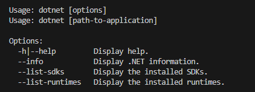

## ASP

Web heeft vaak meerdere smaken, jullie leren later bijvoorbeeld PHP.

een ander variant is ASP .net, die is van microsoft en is ook platform onafhankelijk

## SDK installatie

> `sdk` staat voor `software developers kit`

Ga naar:
- https://dotnet.microsoft.com/en-us/download/dotnet/8.0

- installeer de SDK 8.0 voor jouw systeem
- open je terminal/cmd
    - type dotnet
    - zie je dit?
        > 

## klaar

zag je wat er op het plaatje stond?
    - dan ben je klaar voor de start