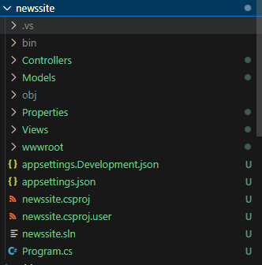

## startup

- maak een repository:
    - `M2flex_ASP`
- clone die naar je PC

- maak in die `M2flex_ASP`  een nieuwe directory:
    - `newssite`
- maak een `.gitignore` file
    - zet daar het volgende in:
    ```
        **bin
        **obj
        **.vs
        **packages
        **/csproj.user
    ```
> !!! Let op dat er geen spaties en tabs voor de ** staan

## eerste project

.net heeft veel verschillende project types, wij gebruiken nu even de `MVC` variant

- maak een nieuwe directory:
    - `newssite`
    - `screenshots`
- open je terminal/cmd
    - ga naar je `newssite` directory
    - type `dotnet new mvc`
    > 


## openen:

- open de directory `newssite` in visual studio code:
    > 

## draaien

- ga naar je `newssite` directory
- in je terminal type :
    - `dotnet build`
    > 
    - als er geen errors zijn:
        - type
            - `dotnet run`
            > 

- open je browser en ga naar het adres wat je in je terminal ziet
    > - bij mij is dat `http://localhost:5272/`
    > - Bij jou kan dat `ANDERS` zijn

- je krijg nu de site:
    > 


#### WINDOWS

- heb je windows? dan mag je vanaf nu visual studio gebruiken:
> dat ontwikkeld sneller
[100_EXTRA_Windows.md](./100_EXTRA_Windows.md)

## Klaar?

- git add .
- git status
    - staan de `bin` en `obj` er tussen?
        - dan is je `.gitignore` niet goed
            - `fix` dat!
- commit naar je repo voor dit vak
