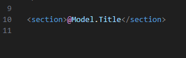

## Laten we nu meerdere berichten tonen

> Hiervoor moeten we de controller aanpassen

- open de `HomeController`
    - voeg het volgende toe:
    > 

> - we hebben nu een `class variable` toegevoegd
> - dat is een List, een `array` achtig ding. 
> - Daar kunnen we `NewsItems` instoppen
> - deze staat op `private` dat betekent dat deze alleen `in` de class gebruikt mag worden

## berichten toevoegen

- Verander nu de `constructor` van `HomeController`:
>
- verzin zelf nog 2 berichten en voeg die toe
    - gebruik andere plaatjes

## Doorgeven aan de view

- ga naar de `Index` function
    - zie je daar ons `NewsItem` nog staan?
        - haal die weg
        - verander nu `item` in `View(item)` naar `newsItems`
        > zo geven we `newsItems` naar de `view` door als `Model`
        > 

## De view nog

- open nu de `Index.cshtml`
    - zet nu onderaan het volgende erin:
    > 

> #### UITLEG
> - nu moet je bericht in de `foreach`  
> 
> - maar `Model` is nu een `List`
>   -`item` is wel een `NewsItem`
> - dus we moeten Model vervangen door item in ons bericht:  
> 

- zet nu je hele bericht in de for
    - en verander `Model.` naar `item.`

- open je site en check:
> 

- maak een `screenshot` van je site `mijn berichten.png`
    - zet die in je `screenshots` directory

## Klaar?

- commit naar je repo voor dit vak