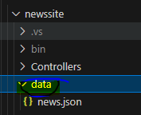
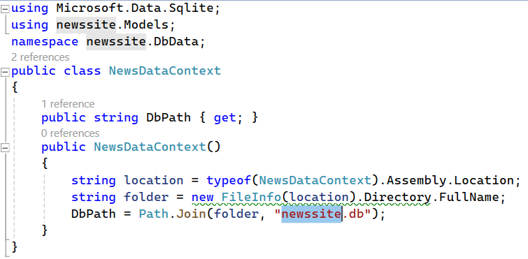
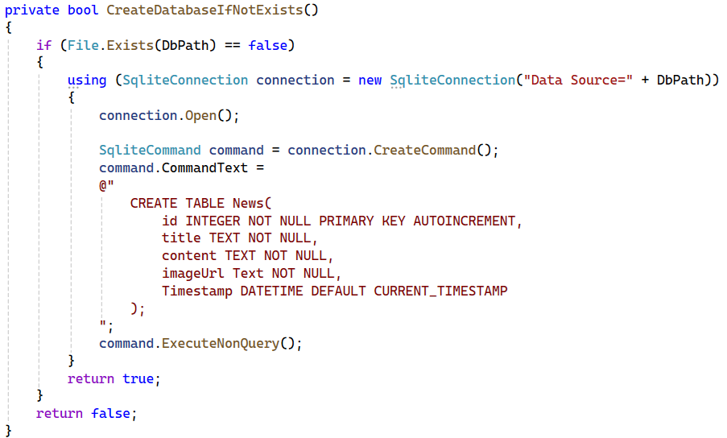
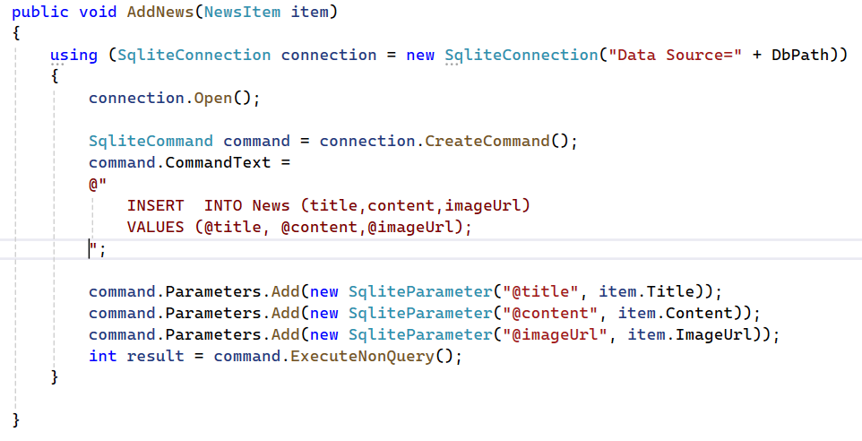
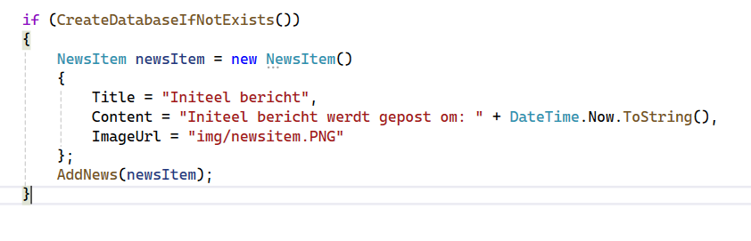
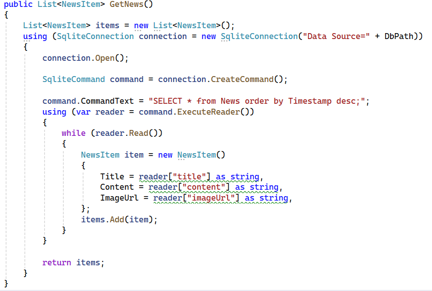
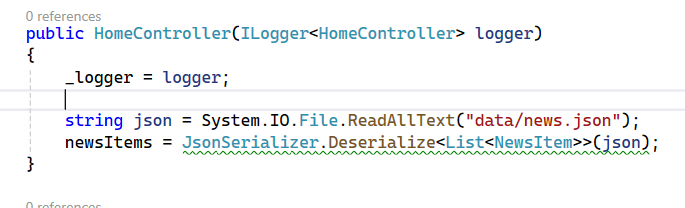
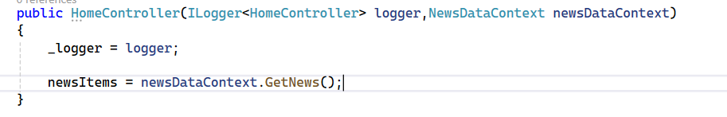
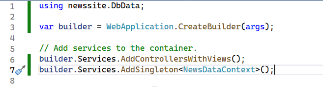
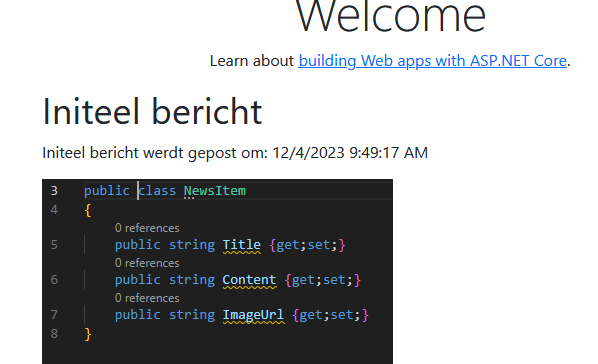

## Json...

Json is leuk maar vaak komt data uit een database

- open een terminal in je `newssite`
    - type `dotnet add package Microsoft.Data.Sqlite`
    > hier halen we een code library van het internet en koppelen we die aan ons project

- verwijder de `data` directory waar de `news.json` in staat:
    >

## Context

- maak een nieuwe map onder de `newssite`:
    - `DbData`
- maak daar een nieuwe file:
    - `NewsDataContext.cs`
> dit wordt onze database file, waar we alles doen met de database

- we maken een nieuwe `constructor` aan
    > net als in `javascript` gaat deze speciale function af, na de `new`
    - neem het volgende over:
        >

> we gebruiken een `truukje` om de database (*newssite.db*) naast onze `.exe` te zetten

## Database maken

> we moeten nu de database laten maken, dat doen we met de classes die we met het commando `dotnet add package Microsoft.Data.Sqlite` geinstalleerd hebben in ons project

- zet deze code onder je constructor IN je class:
        >
> - zie je dat we daar een verbinding met de `newssite.db` file maken?
> - zie je dat we daarna een `create table` SQL statement gebruiken?
>       - dit maakt de table aan in de database

## NewsItem toevoegen

- we maken een nieuwe function om een `NewsItem` toe te voegen:
        >

> - zie je de `public`? dat betekent dat deze ook van buiten de class gebruikt mag worden!
> - we zetten niet de `item.Title` en andere data direct in de `SQL` maar gebruiken parameters
>      - dat is veiliger, anders kunnen we gehacked worden

## Nu gebruiken

- ga naar je constructor (`public NewsDataContext()`) en zet onder `DbPath` de volgende regels code:
    >

## En de data ophalen dan?

dat moet ook nog:
- voeg nog een function toe aan `NewsDataContext`:
    >

## HomeController aanpassen

> #### UITLEG
> - nu moeten we de `HomeController` aanpassen
> - we hadden:
>

- maak daar het volgende van:
    >

## Nog 1 ding

- open `Program.cs`
- hier moeten we onze `NewsDataContext` toevoegen aan de `DependencyInjection`:
    - voeg de code op regel 7 toe:
    >

## TEST!

- start de site en kijk of je dit krijgt:
    >

## Klaar?

- commit naar je repo voor dit vak
