## Add

we gaan nu nog toevoegen dat we een nieuw bericht kunnen toevoegen

## EditorController

- maak een nieuwe file aan onder `Controllers`:
    - `EditorController.cs`
        >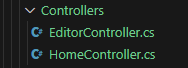
    - zet daar de volgende code in:
        >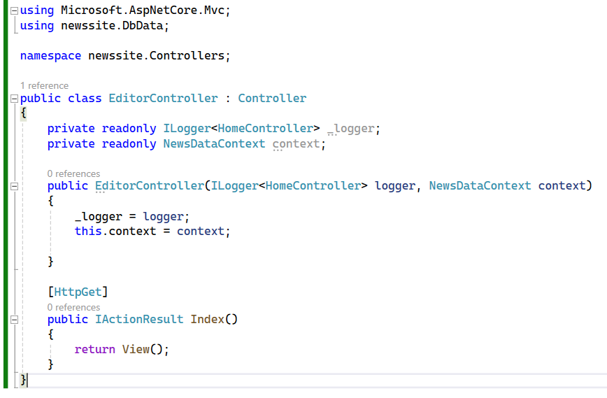
    
## View

- we moeten ook een view maken:
- maak in `Views` een nieuwe directory
    - `Editor`
        - en daarin een nieuwe file:
            - `Index.cshtml`
            >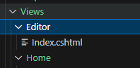
- zet daar het volgende in:
    >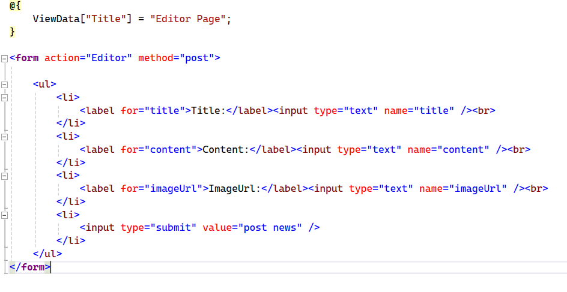

> #### UITLEG
> we maken hier een `html formulier`, wat de data die jij in de site kan invoeren `POST` naar de `EditorController`  
> Daar kunnen we dan de data lezen en in de database stoppen

## Navigation

- onze pagina bestaat, maar we kunnen er niet bij
    - open `_Layout.cshtml` onder `Views/Shared`
    - zet daar een extra `nav` in:
    
    >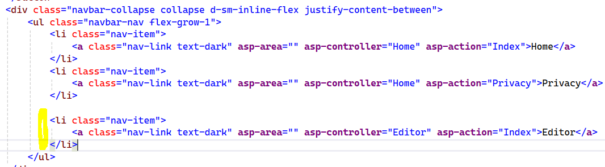

## TEST!

- start de site en kijk of je dit krijgt:
    - click ook even op `Editor`
    >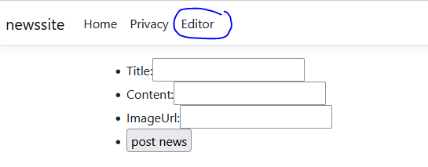

## de database in

- maak een nieuwe file onder `Models`:
    - `PostEditViewModel.cs`
    - zet daar de volgende code in:
    >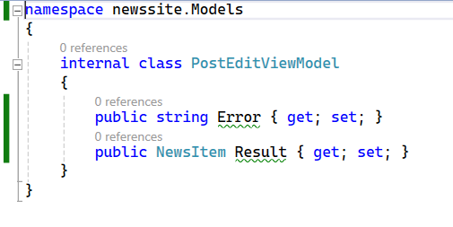

> Dit wordt ons `ViewModel` waar we fouten mee kunnen teruggeven aan de gebruiker

- open `EditorController.cs`
    - zet daar de volgende code in:
    >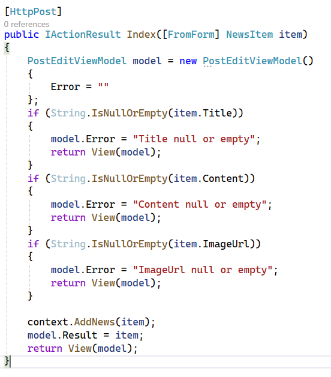

> #### UITLEG
> - zie je die `[HttpPost]` die geeft aan dat we hier luisteren naar `Http posts requests` (`method=post` in de form in de html)
> - zie je die `[FromForm]` die leest het formulier en probeert daar een `NewsItem` van te maken. 
>   - Handig! hoeven we dat zelf niet te doen
> - als we ons newsitem hebben, zeggen we tegen onze `NewsDataContext` gewoon: voeg die toe!

## Testen

- open je site
    - ga naar de editor
        - en type in:        
        >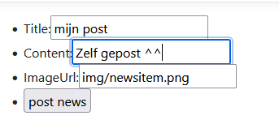
- ga naar je home, zie je je post?
        >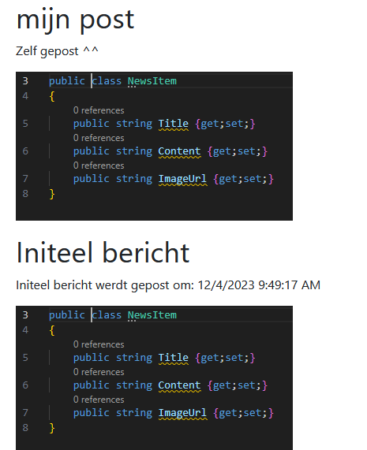

## Fouten

- open `Views/Editor/Index.cshtml`
    - hier moeten we nog wat maken om fouten te laten zien:
        >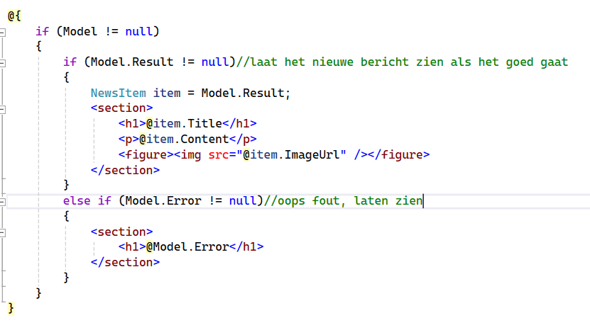
> #### UITLEG
> - nu tonen we het nieuwe bericht als het goed gegaan is
> - als het fout was tonen we de fout

## TESTEN

- wel even testen:
    - post nu een leeg bericht:
        >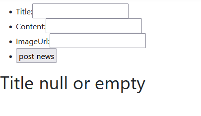
    
## Klaar?

- commit naar je repo voor dit vak
