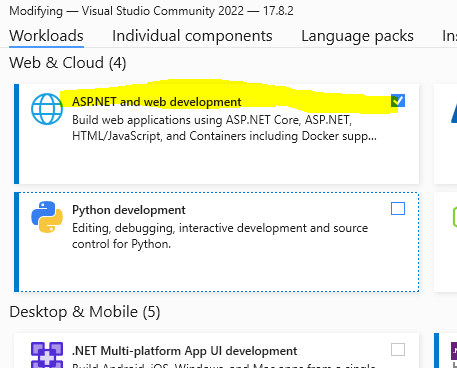
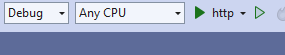

## WINDOWS install

download de community version
- [visual studio](https://visualstudio.microsoft.com/thank-you-downloading-visual-studio/?sku=Community&channel=Release&version=VS2022&source=VSLandingPage&cid=2030&passive=false)

- start de installer en vink deze workload aan:
    > 
- open je terminal/cmd
    - type dotnet
    - zie je dit?
        > 

## werkt het?

zag je wat er op het plaatje stond?
    - dan ben je klaar voor de start

    
## WINDOWS met visual studio:

#### project openen:
- dubbel click op het newssite.csproj
    - visual studio opent
    > 

#### draaien

- in visual studio zet je eerst de `https` naar `http`:
     > 
- druk dan op de `groene play` knop
     > 
